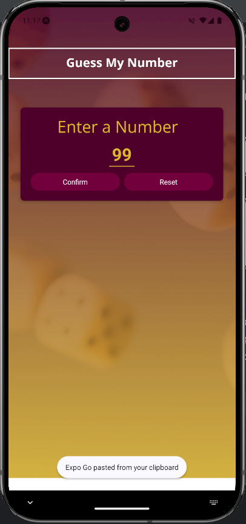
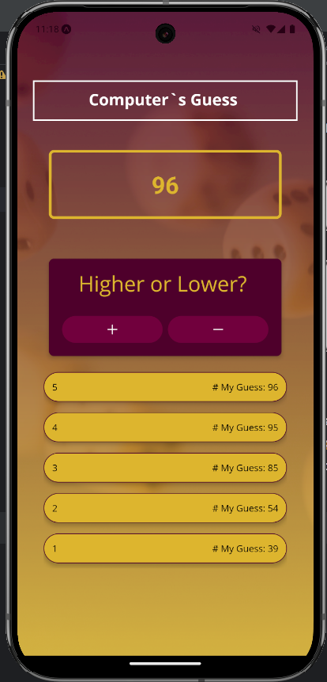
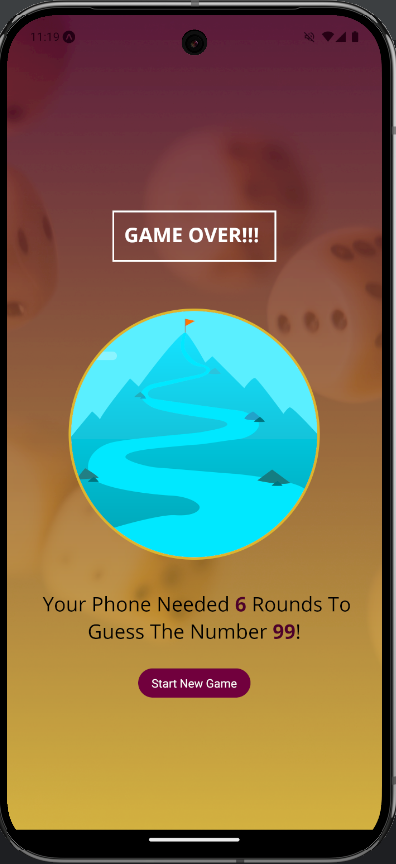

# 🎮 **Guess My Number Game** 🎲

**Guess My Number Game** – a fun React Native app where you challenge the app to guess your number! ✨

---

## 🌟 **Features**
- 🎨 **Dynamic User Interface**: Responsive design with custom fonts.  
- 📱 **Multi-Screen Navigation**: Navigate through screens like:
  - **Start Screen**: Enter your number to start the game! 🎉
  - **Game Screen**: Watch as the app guesses your number.  
  - **Game Over Screen**: See the results and restart your journey! 🔁
- 🌐 **Cross-Platform Compatibility**: Runs seamlessly on both Android and iOS devices.
- 📊 **Game Progress Tracker**: See all previous guesses and the rounds taken to guess your number.  

---

## 🛠️ **Technologies Used**
- ⚛️ **React Native**: Core framework for building this mobile app.  
- 🖼️ **Expo**: Rapid development environment with support for fonts and images.  
- 🎨 **Custom Styling**: Using `StyleSheet` for clean and modular styles.  
- ✨ **Icons and Fonts**: Beautiful icons powered by `Ionicons` and custom fonts.  

---

## 🚀 **How to Run the Project**
1. Clone the repository:  
   ```bash
   git clone https://github.com/Antot-12/React-Native---Guess-A-Number.git
 
2. Navigate to the project directory:
   ```bash
   cd React-Native---Guess-A-Number
   ```
3. Install dependencies:
   ```bash
   npm install
   ```
4. Start the development server:
   ```bash
   npm start
   ```
5. Scan the QR code in the Expo Go app to run on your device. 📲

---

## 🖼️ **Screenshots**
Here are some screenshots of the app in action:

1. **Start Screen**:  
   

2. **Game Screen**:  
   

3. **Game Over Screen**:  
   

---

## 📝 **TODO List**
- [x] 🎨 **Add Custom Fonts**
- [x] 🔢 **Guess Number Logic**
- [x] 🌌 **Background Styling with Images**
- [x] 📊 **Game Stats Screen**
- [x] 🔄 **Full Landscape Orientation Support**
- [x] 🖼️ **Component Scaling for Large Screens**
- [x] 📱 **Tablet Compatibility**
- [ ] 🌍 **Multilingual Support**
